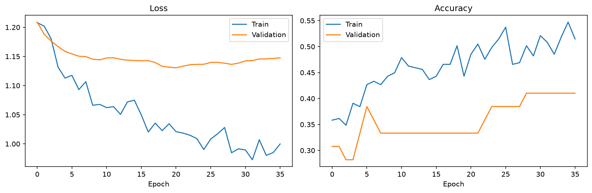

# Football Match Outcome Prediction using Machine Learning
> End-to-end machine learning project for multiclass football match outcome prediction using historical performance and pre-match features.
> 


Machine learning project focused on predicting football match outcomes using historical and pre-match data.

The model performs a multiclass classification task with three possible outcomes:

- `1` — Local Team win
- `X` — Draw
- `2` — Visitor Team win

## Project Objective

The main objective of this project is to develop a neural network capable of estimating the outcome of a football match based on historical team performance and pre-match features.

The project also explores the complete machine learning workflow, from data preparation and feature scaling to model training, evaluation and prediction.

## Technologies

- Python
- Pandas
- NumPy
- Scikit-learn
- TensorFlow / Keras
- Matplotlib
- Joblib

## Dataset

The project uses historical football match data obtained from a web source.


The model was trained using historical football match data obtained from an external web source.

> **Note:** The `data/dataset.csv` file included in this repository is **not the original dataset used for training**. It is a small representative sample provided only to demonstrate the dataset structure and feature format.
>
> The original dataset is not publicly distributed in this repository.


The dataset contains information used to estimate the outcome of a match. The target variable is `Victoria`, with three possible classes:

```text
1 → Local Team win
X → Draw
2 → Visitor win
```

### Input Features

The model uses a set of features that capture historical results, pre-match probabilities, team rankings, and recent performance trends. These features are described below:

| Feature        | Description                                                                                                                                        |
| -------------- | -------------------------------------------------------------------------------------------------------------------------------------------------- |
| `L`            | Historical result-based feature representing the number of victories obtained by the home team in the last five previous head-to-head encounters.  |
| `X`            | Historical result-based feature representing the number of draws recorded in the last five previous head-to-head encounters.                       |
| `V`            | Historical result-based feature representing the number of victories obtained by the away team in the last five previous head-to-head encounters.  |
| `L_3`          | Historical result-based feature representing the number of victories obtained by the home team in the last three previous head-to-head encounters. |
| `X_3`          | Historical result-based feature representing the number of draws recorded in the last three previous head-to-head encounters.                      |
| `V_3`          | Historical result-based feature representing the number of victories obtained by the away team in the last three previous head-to-head encounters. |
| `Porcentaje 1` | Pre-match probability associated with the first team.                                                                                              |
| `Porcentaje 2` | Pre-match probability associated with the second team.                                                                                             |
| `Rank1`        | Ranking position of the first team.                                                                                                                |
| `Rank2`        | Ranking position of the second team.                                                                                                               |
| `Tendencia_L`  | Historical trend feature describing the results obtained by the home team in its last five matches.                                                |
| `Tendencia_V`  | Historical trend feature describing the results obtained by the away team in its last five matches.                                                |

These features combine information from previous head-to-head encounters with indicators of the teams' current form, ranking, and pre-match probabilities. This allows the model to incorporate both historical performance and information available immediately before the match.


## Methodology

### 1. Data Preparation

The dataset is loaded using Pandas.

The input variables are separated from the target variable `Victoria`.

The target classes are encoded using `LabelEncoder`.

### 2. Train / Validation / Test Split

The dataset is divided into three subsets:

- 80% training
- 10% validation
- 10% test

The splits are stratified to preserve the class distribution.

A fixed random state is used to make the process reproducible.

### 3. Feature Scaling

The input features are standardized using `StandardScaler`.

The scaler is fitted using the training data and then applied to the validation and test sets.

The same saved scaler is used when generating predictions with the trained model.

### 4. Class Imbalance

The target classes are not evenly distributed.

To reduce the impact of class imbalance during training, balanced class weights are calculated using Scikit-learn's `compute_class_weight`.

These weights are passed to the neural network during training.

### 5. Neural Network

The model is implemented using TensorFlow / Keras.

The architecture consists of:

```text
Input
  │
  ▼
Dense(32, ReLU)
  │
  ▼
Dropout(0.3)
  │
  ▼
Dense(3, Softmax)
  │
  ▼
Prediction
```

The model uses:

- Optimizer: Adam
- Loss: Sparse Categorical Crossentropy
- Metric: Accuracy
- Batch size: 32
- Maximum epochs: 200
- Early stopping based on validation loss
- Patience: 15 epochs

The best model weights are restored when training stops.

## Evaluation

The model is evaluated using a held-out test set.

The evaluation includes:

- Accuracy
- Macro F1-score
- Macro ROC-AUC using One-vs-Rest
- Macro Average Precision
- Precision, recall and F1-score for each class

### Test Results

The test set contains 39 samples.

| Metric | Result |
|---|---:|
| Accuracy | **48.72%** |
| Macro F1 | **0.4768** |
| Macro ROC-AUC (OVR) | **0.6333** |
| Macro Average Precision | **0.4930** |

### Classification Report

| Outcome | Precision | Recall | F1-score | Support |
|---|---:|---:|---:|---:|
| `1` | 0.75 | 0.47 | 0.58 | 19 |
| `2` | 0.35 | 0.55 | 0.43 | 11 |
| `X` | 0.40 | 0.44 | 0.42 | 9 |
| **Macro avg** | **0.50** | **0.49** | **0.48** | **39** |

The model achieves its highest F1-score for class `1` (home win), while classes `2` and `X` are more difficult to classify.

The relatively small test set should be taken into account when interpreting these metrics.

## Training History

The training process records training and validation loss and accuracy.

The resulting training history is available in:

```text
results/training_history.png
```



The training curves show that training loss continues to decrease while validation performance stops improving, suggesting some degree of overfitting.

Early stopping is used to prevent unnecessary training once validation loss stops improving.

## Prediction

The repository includes `src/predict.py` for generating predictions using the trained model.

Run:

```bash
python src/predict.py
```

The script loads:

```text
models/modelo.keras
models/scaler.pkl
models/label_encoder.pkl
```

and generates a prediction using a predefined example input.

### Example Input

```text
L = 3
X = 1
V = 0
L_3 = 2
X_3 = 1
V_3 = 0
Porcentaje 1 = 53
Porcentaje 2 = 20
Rank1 = 20
Rank2 = 19
Tendencia_L = 45
Tendencia_V = 20
```

### Example Prediction

The trained model produces:

```text
1: 38.12%
2: 18.74%
X: 43.15%

Predicted outcome: X
```

For this example, the model estimates the highest probability for a draw.

## Project Structure

```text
Football-Match-Outcome-Prediction/
│
├── README.md
├── requirements.txt
├── .gitignore
│
├── data/
│   └── dataset.csv
│
├── src/
│   ├── train.py
│   └── predict.py
│
├── models/
│   ├── modelo.keras
│   ├── scaler.pkl
│   └── label_encoder.pkl
│
└── results/
    ├── metrics.json
    ├── classification_report.txt
    └── training_history.png
```

## Installation

Clone the repository:

```bash
git clone https://github.com/gabi71299/Football-Match-Outcome-Prediction-using-Machine-Learning.git
cd Football-Match-Outcome-Prediction-using-Machine-Learning
```

Install the required dependencies:

```bash
pip install -r requirements.txt
```

## Training

To train the model from scratch:

```bash
python src/train.py
```

The training process:

1. Loads and prepares the dataset.
2. Separates input features and target.
3. Encodes the target classes.
4. Splits the data into training, validation and test sets.
5. Scales the input features.
6. Calculates balanced class weights.
7. Trains the neural network.
8. Applies early stopping.
9. Evaluates the model on the test set.
10. Saves the trained model and preprocessing artifacts.
11. Saves evaluation metrics and training history.

## Prediction

To generate a prediction using the saved model:

```bash
python src/predict.py
```

The script loads the trained model, scaler and label encoder and generates a prediction using the predefined example input.

## Limitations

The current results should be interpreted with caution.

The test set contains only 39 samples, which limits the statistical reliability of the evaluation.

Football match outcomes are inherently difficult to predict, and the current feature set does not capture every factor that may influence a match.

The model should therefore be considered an experimental machine learning project rather than a production prediction system.

## Future Improvements

Potential future improvements include:

- Increasing the amount of historical data.
- Improving feature engineering.
- Adding additional team and match features.
- Comparing the neural network with other machine learning algorithms.
- Performing systematic hyperparameter tuning.
- Using cross-validation for more robust evaluation.
- Expanding the prediction interface.
- Further investigating class imbalance.
- Evaluating the model on a larger and more recent test set.

## Author

**Gabriela Alonso Úbeda**

LinkedIN: www.linkedin.com/in/gabriela-alonso-úbeda

